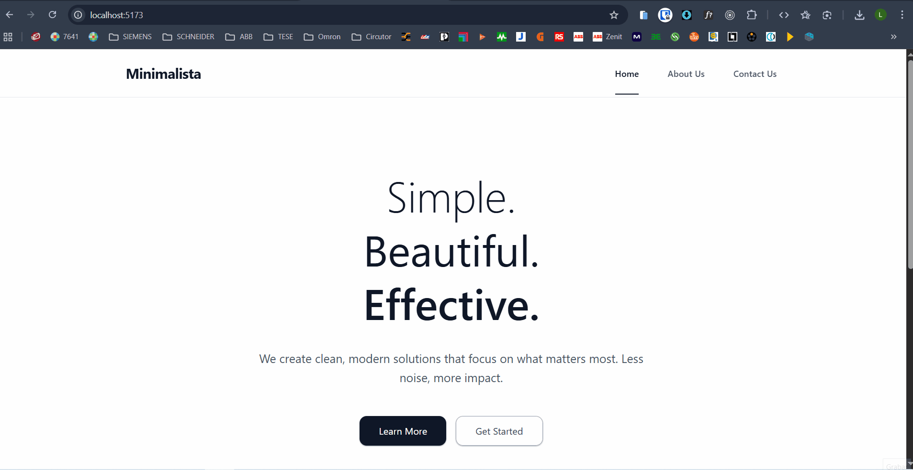

# Minimalist Three-Page Website

Vista previa de la aplicación:



Este proyecto es una aplicación web minimalista con tres páginas principales, creada como boceto base para mostrar en repositorios de GitHub y portfolios personales. Sirve como plantilla inicial para desarrollar sitios web modernos y responsivos utilizando React, TypeScript y Vite.

## Características

- **Diseño minimalista**: Interfaz limpia y sencilla para destacar la estructura del sitio.
- **Tres páginas principales**:
  - **Inicio**: Presentación o bienvenida.
  - **Sobre mí / Información**: Espacio para detalles personales o de proyecto.
  - **Contacto / Formulario**: Ejemplo básico de interacción con el usuario.
- **Navegación entre páginas** sin recargar la aplicación.
- **Código estructurado y fácil de modificar** para adaptarlo a distintos propósitos.
- **Configuración rápida** con Vite para desarrollo y despliegue.

## Tecnologías utilizadas

- [React](https://react.dev/)
- [TypeScript](https://www.typescriptlang.org/)
- [Vite](https://vitejs.dev/)

## Instalación y ejecución

1. Clona el repositorio:
   ```sh
   git clone https://github.com/LendyAbel/minimalist_three-page_website.git
   cd minimalist_three-page_website
   ```
2. Instala las dependencias:
   ```sh
   npm install
   ```
3. Ejecuta la aplicación en modo desarrollo:
   ```sh
   npm run dev
   ```
4. Abre [http://localhost:5173](http://localhost:5173) en tu navegador para ver el resultado.

## Propósito

Este boceto está pensado como punto de partida para proyectos personales, pruebas de concepto, portfolios y presentaciones en repositorios GitHub. Puedes usarlo, modificarlo y ampliarlo para tus propios fines.

---

¿Quieres personalizar la estructura o los estilos? Simplemente modifica los componentes en la carpeta `src` para adaptarlos a tus necesidades.
